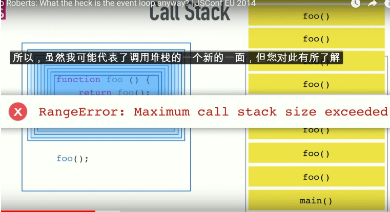

# ★5月23号开始的3个问题

## ◇为什么需要同源策略？后台不是可以禁止用户的请求吗？

我的想法：

后台可以过滤掉某些请求，如用户A浏览这个页面是有权限才能浏览的，而用户B  copy了A这个需要权限才能浏览的页面到他那台机子的浏览器里去了，结果无法看到内容。

我们知道可以通过JSONP跨域请求数据，根据响应回来的数据判断程序的流向。而通过AJAX发送的请求却不行了，为什么？不就拿一个数据吗？有那么危险吗？如果真的危险的话，后台就禁止这个来源不明的请求呗？何必要搞个同源策略呢？

老师：

> HTTP是一个无状态的协议
>
> 服务端收到一个请求之后，它怎么知道是谁的？
>
> 即使知道是谁的，然后故意去禁止的话，那么对服务端的要求就比较高了，如「服务端需要看请求的来源，一般根据请求头referer来判断这个值是否符合我们的白名单，不符合的话，就禁止，不给你响应」
>
> 这样对服务端的要求就比较高了啊！服务端必须要专门做这个才可以了啊
>
> 如果浏览器有了同源策略，默认就全部禁止了啊，这样服务端就不用搞事了啊！
>
> 除非服务端开一个口子，允许某个域名可以用我的数据的时候，那浏览器才会放行
>
> 简而言之，就是白名单和黑名单 ，浏览器默认把非同源的就扔到黑名单里去了，而服务端就开个白名单，某些叼毛就可以拿到你想要的数据了，这就安全多了

## ◇有这么一段demo，为什么arguments[0]能拿到事件参数e?

```js
btn.onclick = function() {
  console.log(arguments[0])
}
```

[demo链接](http://js.jirengu.com/retev/1/edit?html,css,js,output)

我的想法是：

按钮被点击后，就执行这个函数，就像是这样`onclick()`，由于是没有传递参数的，那么打印的值就是 `undefined`吧！就像是这个样子：

```js
function xx() {console.log(arguments[0])}
xx()  //undefined
```

结果，我点击按钮后，打印的值是：

```js
MouseEvent {isTrusted: true, screenX: 1173, screenY: 282, clientX: 152, clientY: 105, …}
```

一个MouseEvent对象

平时写的时候是这样的：

```
btn.onclick = function(e) {
  console.log(arguments[0])
}
```

搞了一个叫「e」的形参过来，然后我以为就是这样：`onclick(e)`，传来一个实参过来，这个实参的值就是上面打印的值，然后没有写e，我就认为是 `undefined`

于是我猜测：

这应该是个回调函数吧，点击后，传参执行这个匿名函数，反正没有形参的函数，搞几个实参进去也没事…… 

查了些资料，没有找着，于是上知乎提了个[问题](https://www.zhihu.com/question/277924379)，有了一个回答：

> 大哥，你这里是在声明函数。传参是调用时候传参，又不是你调用的，你咋知道没传参。 onclick这个函数，是浏览器调用的，他给你传了个参数：event。 

问了一下老师：

> 先来个对比：
>
> ```js
> function fn(a,callcack) {
>     callback(++a)
> }
> fn(3,function() {
>     console.log(arguments[0])
> })
> btn.addEventListener('click', function() {
>     console.log(arguments[0])
> })
> //这是一种类似的写法，只不过变了一种方式
> //换句话说，把这个函数绑定到一个地方，用户点击就会触发这个函数，触发的时候就会执行这个函数，同时把
> //事件作为参数传递进去
> btn.onclick = function() {}
> ```
>
> 底层所做的事，如fn这个函数一样，点击按钮后，底层拿到这个函数，回调传参执行这个函数

## ◇JavaScript-demo的执行是不是像C语言一样，写demo的时候要放到main()这个入口里去写？

这个问题来自这张图：



调用foo这个函数，于是就到了call stack，可call stack的第一层是个main()，这个main是什么时候调的？于是猜测，我们写的demo，在底层里都是放到一个叫main的函数里面的，它作为程序入口，那么我们写的demo一直在main的肚子里面咯。这样我们就是一层函数嵌套着一层函数咯？demo执行完这个main也就释放了？

老师说：

> 没有这回事，JavaScript比C要简单得多

未完……如：还要读这篇文章 [JavaScript随笔(三)：JS也有入口函数Main](http://www.cnblogs.com/manxisuo/p/4796709.html)

# ★衍生的子问题

## ◇什么叫底层？

> [什么叫底层代码？](https://zhidao.baidu.com/question/202827979.html)
>
> [请问编程中的 上层 和 底层 是什么意思？ 比如有人说 ＂游戏用JAVA或c#做上层，用汇编或c/](https://zhidao.baidu.com/question/2267997554071810668.html?qbl=relate_question_1)
>
> [高级语言与低级语言的区别](https://blog.csdn.net/guoxiaoqian8028/article/details/9103151)
>
> 一般来说，表层就是指展现给用户看的部分；而底层就是系统的最核心的部分。一般我们认为，越接接硬件的编程就越底层。 
>
> 用 [C/C++](https://www.baidu.com/s?wd=C%2FC%2B%2B&tn=SE_PcZhidaonwhc_ngpagmjz&rsv_dl=gh_pc_zhidao) 这类语言更适合写游戏引擎。游戏嘛，必定是要求[响应速度](https://www.baidu.com/s?wd=%E5%93%8D%E5%BA%94%E9%80%9F%E5%BA%A6&tn=SE_PcZhidaonwhc_ngpagmjz&rsv_dl=gh_pc_zhidao)极高的，总不能按完键盘了等100[毫秒](https://www.baidu.com/s?wd=%E6%AF%AB%E7%A7%92&tn=SE_PcZhidaonwhc_ngpagmjz&rsv_dl=gh_pc_zhidao)才响应，生成个三维地图电脑卡半天。但一般不会游戏的所有部分都用 [C/C++](https://www.baidu.com/s?wd=C%2FC%2B%2B&tn=SE_PcZhidaonwhc_ngpagmjz&rsv_dl=gh_pc_zhidao) 来完成，为什么？上面说了，可维护性差、[可移植性](https://www.baidu.com/s?wd=%E5%8F%AF%E7%A7%BB%E6%A4%8D%E6%80%A7&tn=SE_PcZhidaonwhc_ngpagmjz&rsv_dl=gh_pc_zhidao)差。这时候就需要用[面向对象](https://www.baidu.com/s?wd=%E9%9D%A2%E5%90%91%E5%AF%B9%E8%B1%A1&tn=SE_PcZhidaonwhc_ngpagmjz&rsv_dl=gh_pc_zhidao)这种“高级语言”出马了。 
>
> 至于题主提到的“不同语言之间的互通”，建议题主理解一下“接口”（不是[面向对象](https://www.baidu.com/s?wd=%E9%9D%A2%E5%90%91%E5%AF%B9%E8%B1%A1&tn=SE_PcZhidaonwhc_ngpagmjz&rsv_dl=gh_pc_zhidao)里的“接口类型”）的概念。 
>
> 完成一项工作的工作量是不变的，机器做的 多了，人就做的就少了，同时人对程序的很多细节的控制性也减弱了。各种语言都是在这个平衡点附近纠结。从C/C++的注重机器运算效率的优化，到C#/JAVA注重开发效率的优化。人操作起来更加方便了，更高效了，代价就是，机器要处理的东西更多，运算效率被进一步压缩。但是这个压缩在许可范围内，那么这也是一种进步。 
>
> 高级语言程序存在工作冗余，有效率损失。 据说C语言有10%的效率损失。 这是涉及到语言跟机器指令之间的耦合度 。耦合度越大，编译器翻译过程越简单，产生的冗余越少。对应汇编来书，由于与机器码一一对应，所以翻译后基本没有冗余 。而高级语言由于进行了抽象和封装，所以与机器指令间的耦合度较低，因此整个翻译过程较复杂，因此在高级语言在具体化的过程中不可避免会产生较多的冗余 

## ◇JavaScript、浏览器、事件之间的关系

> JavaScript 程序采用了异步事件驱动编程（Event-driven programming）模型，维基百科对它的解释是：
>
> > 事件驱动程序设计（英语：Event-driven programming）是一种电脑程序设计模型。这种模型的程序运行流程是由用户的动作（如鼠标的按键，键盘的按键动作）或者是由其他程序的消息来决定的。相对于批处理程序设计（batch programming）而言，程序运行的流程是由程序员来决定。批量的程序设计在初级程序设计教学课程上是一种方式。然而，事件驱动程序设计这种设计模型是在交互程序（Interactive program）的情况下孕育而生的
>
> 简页言之，在 web 前端编程里面 JavaScript 通过浏览器提供的事件模型 API 和用户交互，接收用户的输入
>
> 由于用户的行为是不确定的，也就是说不知道用户什么时候发生点击、滚动这些动作。这种场景是传统的同步编程模型没法解决的，因为你不可能等用户操作完了才执行后面的代码
>
> 内容来自 [★JavaScript 浏览器事件](https://keelii.github.io/2016/09/29/javascript-browser-event/)

## ◇请求头referer有啥用？

> TODO：
>
> [【译】关于控制 Referer 你想要知道的一切（和更多的）](https://75team.com/post/everything-you-could-ever-want-to-know-and-more-about-controlling-the-referer-header-fastmail-blog.html)

